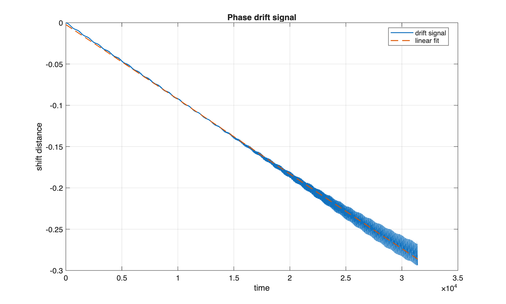

Example phase shift signal extracted from the simulation.  
The approximately linear growth indicates a small propagation speed mismatch.

# Phase Drift in Long-Time Symplectic Simulation of an FPUT-beta Traveling Wave

This repository contains a computational experiment studying phase drift in long-time symplectic simulations of a traveling wave in the periodic Fermi-Pasta-Ulam-Tsingou (FPUT-beta) lattice.

The goal of the experiment is to understand why numerical error appears to grow in long-time simulations of traveling waves.

Two possible explanations are considered:

1. genuine deformation of the waveform
2. accumulated phase drift caused by a small propagation-speed mismatch

The numerical evidence indicates that most of the observed error growth is caused by phase drift rather than instability of the waveform.

---

# Model

We study the periodic FPUT-beta lattice with bond potential

phi(r) = 0.5 r^2 + 0.25 r^4

and force

phi'(r) = r + r^3

The equations of motion are

x_ddot_i = phi'(x_{i+1} - x_i) - phi'(x_i - x_{i-1})

with periodic boundary conditions.

---

# Traveling wave construction

A traveling-wave-like profile is computed using

- Fourier spectral discretization
- Newton continuation
- a discrete traveling-wave residual equation

Parameters used in the experiment:

L = 16  
k = pi / 16  
speed shift target = 0.02  

The reference wave speed is

c_ref = c0 + speed_shift

where

c0 = sqrt(2*(1 - cos(k))) / k

The base wave profile is repeated several times to create the full lattice used for time integration.

---

# Time integration

The system is integrated using the velocity-Verlet (Stormer-Verlet) symplectic method.

Typical parameters used in the simulations:

dt = 0.01  
simulation length about 1000 wave periods  
sampling rate = 4 samples per period

---

# Diagnostics

Several diagnostics are recorded during the simulation.

Direct waveform error  
Relative L2 difference between the numerical state and the reference traveling-wave profile.

Alignment-based error  
For each sampled state the optimal spatial shift s(t) is computed by minimizing

|| u(x,t) - u0(x + s) ||_2

Sub-grid translations are implemented using FFT interpolation.

Phase drift estimate  
The shift signal is

1. unwrapped  
2. corrected by subtracting the expected translation  
3. fit using linear regression  

to estimate a drift rate Delta c.

Energy drift  
Energy is computed as

H = sum(0.5 * v_i^2) + sum(phi(x_{i+1} - x_i))

and remains nearly conserved throughout the simulation.

---

# Observed behavior

The simulations show the following behavior:

- Direct L2 error grows roughly linearly in time
- After optimal translation alignment, waveform error remains small
- The optimal shift grows approximately linearly in time
- Linear regression gives high R^2 values
- Estimated drift rate Delta c is about 1e-5
- Energy drift remains extremely small

These results suggest that the apparent error growth mainly reflects phase drift rather than deformation of the waveform.

---

# Repository structure

src/
    build_traveling_wave_frac.m
    run_phase_drift_from_tw_frac.m
    nsoli.m

experiments/
    validate_time_step.m
    validate_repeats.m
    validate_newton_tolerance.m
    generate_figures.m

figures/
    generated plots

archive/
    earlier exploratory scripts

The src directory contains reusable functions.  
The experiments directory contains scripts that run the numerical tests.  
The figures directory stores generated plots.

---

# Reproducing the experiment

From MATLAB, run the validation scripts

validate_time_step  
validate_repeats  
validate_newton_tolerance  

Then generate the figures

generate_figures

The scripts will reuse saved results if they already exist.

---

# Notes

This repository documents a reproducible numerical experiment rather than a polished software package.  
The emphasis is on clear numerical diagnostics and interpretation of the results.
