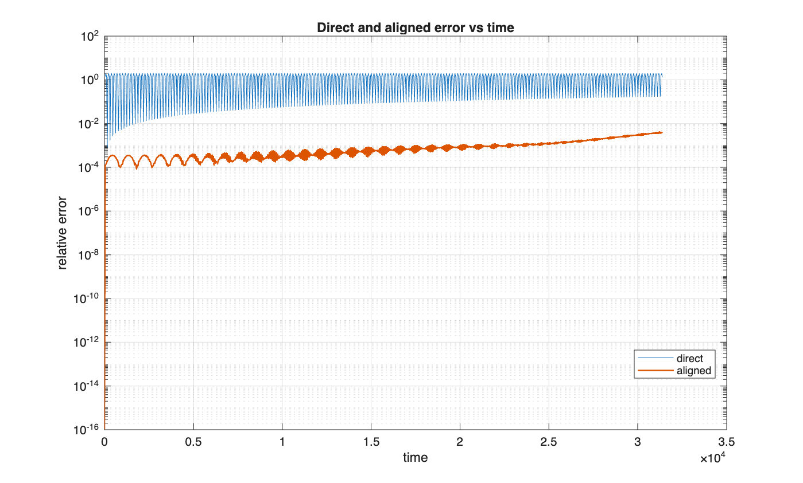
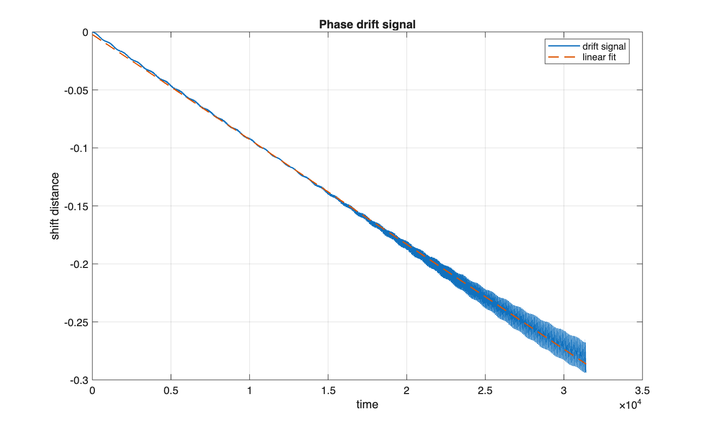

# Phase drift in long-time symplectic simulation of an FPUT-beta traveling wave

A small numerical study of a simple question: when a traveling-wave simulation slowly stops lining up with its reference profile, is the wave actually deforming, or has it mostly shifted in phase?

The main result here is that **most of the long-time error in the tested setup is coherent phase drift rather than immediate waveform breakdown**. After optimally translating the numerical profile, the remaining waveform error is much smaller than the direct error against a fixed reference.



The phase shift extracted from the same runs grows approximately linearly in time, which is consistent with a small propagation-speed mismatch accumulating over many periods.



## What was checked

| Check | Setup / interpretation |
|---|---|
| Long-time integration | About 1,000 wave periods with Störmer-Verlet time integration |
| Time-step sensitivity | `dt = 5e-3, 2.5e-3, 1.25e-3, 6.25e-4` |
| Domain sensitivity | Repeated-domain runs to check dependence on lattice repetition |
| Nonlinear solve sensitivity | Newton-tolerance sweep for the traveling-wave construction |
| Shape error | Direct error compared with translation-aligned error |
| Phase drift | FFT-based sub-grid alignment followed by a linear fit to the unwrapped shift |
| Conservation check | Relative Hamiltonian-energy drift monitored throughout the runs |

The point of these checks is not to claim a theorem about all FPUT lattices. They are there to separate a numerical phase effect from genuine loss of waveform shape in one controlled experiment.

For a figure-by-figure summary, see [RESULTS.md](RESULTS.md).

---

## Model

The periodic FPUT-beta lattice uses the bond potential

```text
phi(r) = 0.5 r^2 + 0.25 r^4
```

with force

```text
phi'(r) = r + r^3
```

and equations of motion

```text
x_ddot_i = phi'(x_{i+1} - x_i) - phi'(x_i - x_{i-1})
```

under periodic boundary conditions.

## Traveling-wave construction

The reference profile is computed with

- Fourier spectral discretization,
- Newton continuation,
- and a discrete traveling-wave residual equation.

The main setup uses

```text
L = 16
k = pi / 16
speed shift target = 0.02
```

with reference speed

```text
c_ref = c0 + speed_shift
```

and

```text
c0 = sqrt(2*(1 - cos(k))) / k
```

The base profile is then repeated to form the lattice used for time integration.

## Time integration

The dynamics are advanced with the velocity-Verlet / Störmer-Verlet symplectic method.

The time-step validation script uses

```text
dt = 5e-3, 2.5e-3, 1.25e-3, 6.25e-4
simulation length = 1000 wave periods
number of repeated base domains = 3
sampling rate = 4 samples per period
```

A larger `dt = 0.01` is used only for lightweight smoke testing.

## Diagnostics

### Direct waveform error

Relative L2 difference between the numerical displacement profile and the fixed reference profile.

This quantity can become large over long times even when the numerical wave still has nearly the same shape, because the wave has moved relative to the fixed reference.

### Alignment-based waveform error

For each sampled numerical profile, an optimal spatial shift `s(t)` is chosen to minimize

```text
|| u(x,t) - u0(x + s) ||_2
```

Sub-grid translations are applied with FFT interpolation.

Comparing the aligned and unaligned errors is the central diagnostic in the repository.

### Phase-drift estimate

The measured shift signal is

1. unwrapped,
2. corrected by subtracting the expected translation,
3. fit with a straight line after the initial part of the run.

The fitted slope is interpreted as a coherent phase-drift rate in the alignment convention used here. Its sign depends on the chosen translation convention, so it is not presented as an independently derived wave speed.

### Energy drift

The Hamiltonian is

```text
H = sum(0.5 * v_i^2) + sum(phi(x_{i+1} - x_i))
```

and the scripts track the maximum relative energy drift as a numerical consistency check.

## Validation experiments

Three longer sweeps are included:

- `experiments/validate_time_step.m` varies the Störmer-Verlet timestep.
- `experiments/validate_repeats.m` varies the number of repeated base domains.
- `experiments/validate_newton_tolerance.m` varies the nonlinear-solver tolerance used to construct the traveling wave.

Each experiment stores a summary table containing the phase-drift estimate, fit uncertainty, fit quality, traveling-wave residual, aligned/direct error, and relative energy drift.

## Repository structure

```text
src/
    build_traveling_wave_frac.m
    run_phase_drift_from_tw_frac.m
    nsoli.m

experiments/
    validate_time_step.m
    validate_repeats.m
    validate_newton_tolerance.m
    generate_figures.m

tests/
    smoke_test.m

figures/
    direct_vs_aligned_error.png
    phase_shift_vs_time.png
    energy_drift.png
    drift_vs_dt.png
    drift_vs_repeats.png
    drift_vs_newton_tol.png

archive/
    earlier exploratory scripts
```

`src/` contains the reusable numerical routines. `experiments/` contains the validation sweeps and figure-generation script. `tests/` contains a lightweight integration smoke test, and `archive/` keeps earlier exploratory work out of the main path.

## Reproducing the experiment

From the repository root in MATLAB:

```matlab
addpath('src')
run('experiments/validate_time_step.m')
run('experiments/validate_repeats.m')
run('experiments/validate_newton_tolerance.m')
run('experiments/generate_figures.m')
```

The validation scripts write `.mat` and `.csv` result files. The figure-generation script reuses saved results when they are available.

Expected figures:

```text
figures/direct_vs_aligned_error.png
figures/phase_shift_vs_time.png
figures/energy_drift.png
figures/drift_vs_dt.png
figures/drift_vs_repeats.png
figures/drift_vs_newton_tol.png
```

## Smoke test

A short smoke test checks that the main MATLAB functions still run together on a small problem:

```matlab
run('tests/smoke_test.m')
```

It is meant to catch path and interface problems. It does not replace the longer validation sweeps.

## Limits of the result

This repository documents a reproducible numerical experiment, not a general result about nonlinear lattices and not a polished numerical library.

The conclusion is limited to the tested FPUT-beta traveling-wave setup and parameter range. The useful observation is narrower: translation alignment provides a practical way to distinguish accumulated phase error from actual waveform deformation in long-time simulations.
