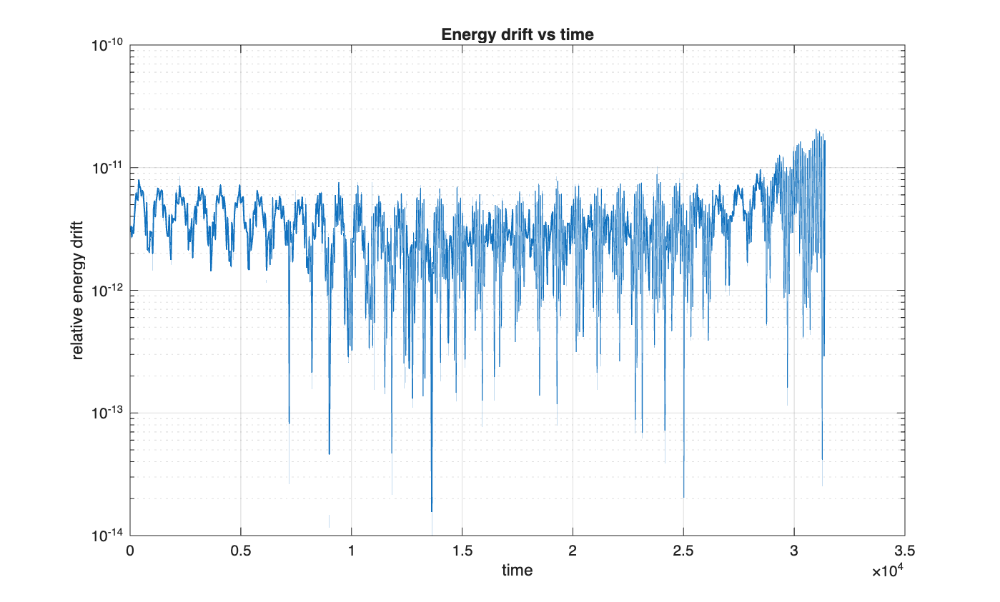
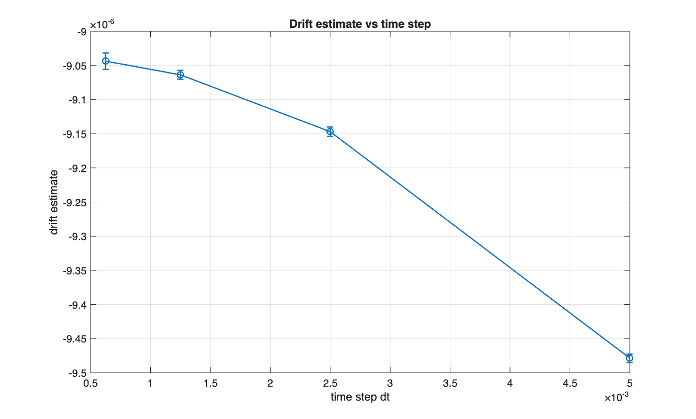
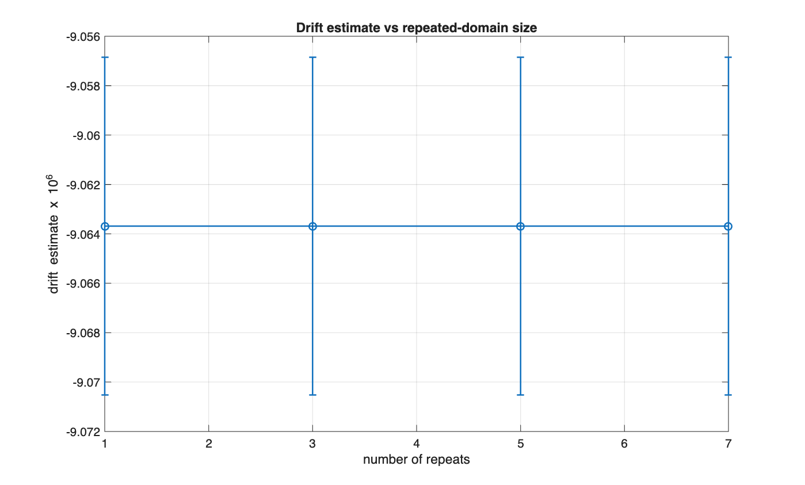
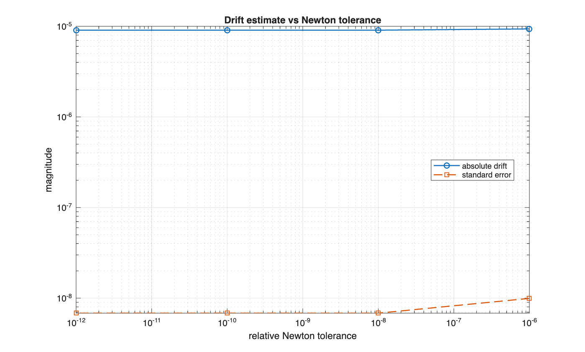

# Results walkthrough

This page is the short version of the project. The full numerical setup and reproduction instructions are in the [README](README.md).

## 1. Direct error overstates the loss of waveform shape


The direct error compares the numerical wave with a fixed reference profile. Over long times, that comparison becomes large because even a small speed mismatch accumulates into a noticeable translation.

The aligned error first shifts the reference profile to best match the numerical solution. Its much smaller size shows that a substantial part of the apparent long-time error is phase error rather than immediate deformation of the waveform.

## 2. The measured translation grows approximately linearly


The optimal shift is unwrapped and corrected for the expected translation. A straight-line fit to the remaining signal gives the phase-drift estimate used in the validation sweeps.

Approximately linear growth is what one would expect if the numerical wave has a small persistent propagation-speed mismatch.

## 3. Energy is used as a separate numerical consistency check



Störmer-Verlet is a symplectic integrator, so the Hamiltonian should remain well controlled over the long runs used here. The scripts record the maximum relative energy drift for each validation case.

This check matters because a clean phase-drift signal would be much less convincing if it were accompanied by obvious energy blow-up or unstable integration.

## 4. The phase estimate is checked against the timestep



The main time-step sweep uses

```text
5e-3, 2.5e-3, 1.25e-3, 6.25e-4
```

for integrations lasting about 1,000 wave periods. Each run records the drift estimate, its standard error, fit quality, aligned/direct error, traveling-wave residual, and relative energy drift.

The goal is not to pick the prettiest timestep. It is to check whether the interpretation survives refinement of the temporal discretization.

## 5. The estimate is also checked against repeated-domain size



The base traveling-wave profile is repeated to build the periodic lattice. Varying the number of repeats tests whether the measured phase effect is an artifact of one particular repeated-domain choice.

## 6. The traveling-wave solve is checked separately



The reference profile is produced with Fourier spectral discretization and Newton continuation. The nonlinear-solver tolerance is varied to test whether the measured long-time drift is simply inherited from an under-resolved traveling-wave solve.

## What the project supports

Taken together, the diagnostics support a limited but useful conclusion: in the tested FPUT-beta traveling-wave setup, much of the long-time discrepancy against a fixed reference can be explained by accumulated phase drift. Translation alignment separates that effect from waveform-shape error and makes the numerical behavior easier to interpret.

## What it does not support

This is not a theorem about FPUT lattices in general, and it does not establish that every long-time error in a symplectic simulation is phase drift. The tests cover a specific model, parameter choice, traveling-wave construction, and set of numerical refinements.
